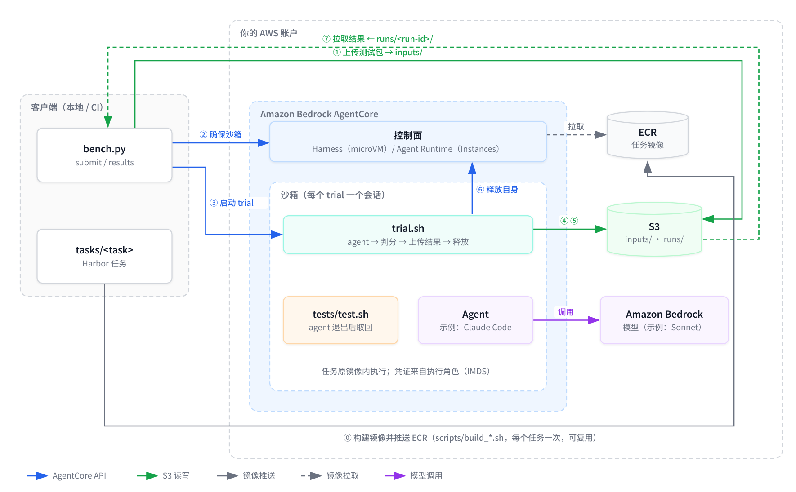
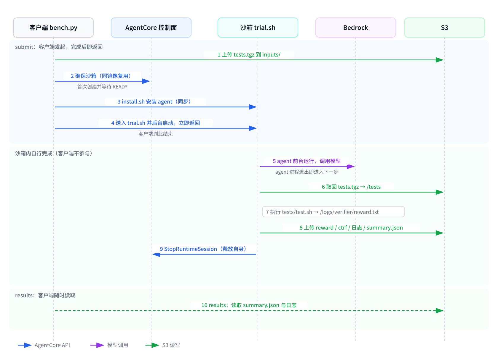
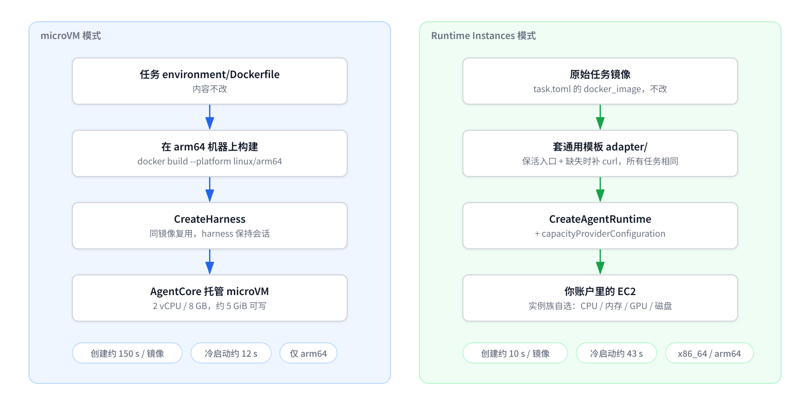
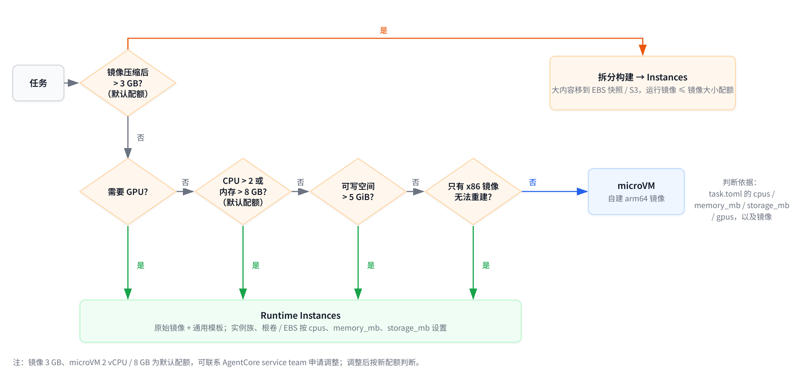

# AgentCore Bench Runner

在 Amazon Bedrock AgentCore 上运行 [Harbor](https://docs.harborframework.com) 格式的 agent 评测任务（如 Terminal-Bench 2.0、Terminal-Bench-Science）。

客户端只做两件事：**创建评测任务**、**拉取结果**。一次评测（trial）从运行 agent、等待它结束、用任务自带测试判分、上传结果，到释放沙箱，全部在 AgentCore Runtime 的会话内完成，不依赖其他调度服务。

本仓库以 **Claude Code + Bedrock Claude Sonnet** 作为示例 agent。agent 只通过两个脚本接入，换成其他 agent 不需要改流程，见[更换 agent](#更换-agent)。

## 架构



| 编号 | 谁执行 | 做什么 |
|---|---|---|
| ⓪ | 客户端 | 准备工作，每个任务做一次：用 `scripts/build_*.sh` 按通用模板构建镜像并推送到 ECR，之后的 trial 复用 |
| ① | 客户端 | 把任务的 `tests/` 打包上传到 S3 `inputs/<task>/<run-id>/tests.tgz` |
| ② | 客户端 | 确保沙箱存在：同一镜像复用同一个 Harness / Agent Runtime，首次使用时创建 |
| ③ | 客户端 | 在新会话里安装 agent，然后送入 `trial.sh` 并后台启动。**调用立即返回，客户端到此结束** |
| ④ | 沙箱 | agent 退出后，`trial.sh` 从 S3 取回测试包 |
| ⑤ | 沙箱 | 执行 `tests/test.sh` 得到 `reward.txt`，把 reward、ctrf、日志、`summary.json` 写到 S3 `runs/<task>/<run-id>/` |
| ⑥ | 沙箱 | 调用 `StopRuntimeSession` 停止自己的会话，沙箱释放 |
| ⑦ | 客户端 | 任何时候读取 `runs/<task>/<run-id>/summary.json` 获得结果 |

## 生命周期



- **客户端不参与中间过程**：submit 返回后，不需要保持连接，也不轮询沙箱。
- **agent 结束即判分**：`trial.sh` 以前台方式运行 agent，进程退出后直接进入判分，不依赖外部判断。
- **测试在 agent 结束后才进入沙箱**：测试包放在 S3，agent 运行期间不在沙箱内。
- **`summary.json` 是完成标记**：它最后写入，出现即表示 trial 结束；`status.json` 记录当前阶段（agent / verifier / uploading）。
- **沙箱自行释放**：结果写完后 `trial.sh` 停止自己的会话。会话的空闲超时设为 8 小时，只作为兜底（原因见 [limitations](docs/limitations.md#会话与空闲超时)）。

## 两种运行模式



| | microVM 模式 | Runtime Instances 模式 |
|---|---|---|
| 计算 | AgentCore 托管 microVM | 你账户里的 EC2（capacity provider） |
| 沙箱资源 | `Harness` | `Agent Runtime` + `capacityProviderConfiguration` |
| 镜像 | 用任务 `environment/Dockerfile` 原样构建 arm64 镜像 | 用任务 `docker_image` 原始镜像，套通用模板 `adapter/` |
| 规格 | 固定 2 vCPU / 8 GB | 实例族自选（CPU、内存、GPU、磁盘） |
| 创建时间（沙箱定义，每个镜像一次） | 约 150 s | 约 10 s |
| 冷启动时间（每个 trial 的新会话） | 约 12 s | 约 43 s（c7i.xlarge，需先起一台 EC2） |
| 适合 | 轻量任务 | 重任务、x86 专属依赖、官方预构建镜像 |

两种模式的客户端命令、`trial.sh`、结果格式完全相同，只有 `--mode` 和镜像不同。

创建时间只在某个镜像第一次使用时发生一次，之后的 trial 复用沙箱定义；每个 trial 都要付的是冷启动时间。所以按单个 trial 算，microVM 启动更快。两项都是实测，细节见 [limitations](docs/limitations.md#时间开销实测)。

### 选择模式



细节见 [docs/modes.md](docs/modes.md)。

## 任务格式（Harbor）

一个任务是一个目录，分两组文件：

```
<task>/
├── instruction.md      题目，交给 agent
├── task.toml           超时、资源、网络、镜像（docker_image）等配置
├── environment/        agent 的运行环境：Dockerfile 及其构建上下文
├── tests/              判分：test.sh 写出 /logs/verifier/reward.txt（或 reward.json）
└── solution/           参考解（本工具不使用）
```

本工具读取 `instruction.md`、`task.toml`（`[agent].timeout_sec`、`[verifier].timeout_sec`、工作目录）和 `tests/`，任务文件不做任何修改。

## 镜像处理（模板化，不按任务手改）

| 模式 | 命令 | 做了什么 |
|---|---|---|
| microVM | `scripts/build_microvm.sh <task-dir> <ecr-repo>` | 对 `environment/` 执行 `docker build --platform linux/arm64`，Dockerfile 原样使用 |
| Instances | `scripts/build_instances.sh <docker_image> <ecr-repo>` | `FROM <docker_image>`，只加保活入口（`/opt/bench/`），镜像里缺 curl 时补装 curl 和 ca-certificates |
| Instances，镜像超过上限 | `scripts/build_split.sh <docker_image> <ecr-repo> <s3-prefix> <dir>...` | 大目录移到 S3，瘦身镜像套同一模板；`trial.sh` 在 agent 启动前放回原路径。见 [docs/large-images.md](docs/large-images.md) |

同一条命令适用于所有任务。

## 批量运行

```bash
scripts/build_all.sh microvm <ecr-registry> tasks/*        # 在 arm64 机器上构建全部任务
python runner/batch.py --mode microvm --image '<ecr-registry>/bench/{task}:arm64' \
                       --jobs 10 --out out-microvm tasks/*
```

构建或运行失败的任务会记录原因并跳过，整批继续。输出 `results.jsonl`（每个任务一行）和 `summary.md`（reward、耗时、磁盘余量、错误）。Terminal-Bench 2.0 全量 89 个任务的实测见 [docs/batch-tests.md](docs/batch-tests.md)。

## 快速开始

前置条件：Python 3.11+、Docker、已配置的 AWS 凭证（`aws sts get-caller-identity` 能返回身份）。

```bash
pip install -r requirements.txt                 # boto3 >= 1.43.98

# 1. 执行角色（沙箱内使用）：把策略里的 <results-bucket> / <prefix> / <account-id> 替换掉
aws iam create-role --role-name bench-runner-exec \
    --assume-role-policy-document file://iam/execution-role-trust.json
aws iam put-role-policy --role-name bench-runner-exec --policy-name bench-runner \
    --policy-document file://iam/execution-role-policy.json

# 2. 配置
cp config.example.json config.json              # 区域、角色 ARN、模型、结果 bucket
                                                # Instances 模式另需 capacity_provider_arn

# 3. 构建镜像
scripts/build_microvm.sh tasks/fix-git <ecr>/bench/fix-git                          # microVM（arm64 机器上）
scripts/build_instances.sh alexgshaw/fix-git:20251031 <ecr>/bench/fix-git          # Instances

# 4. 创建评测任务（返回 run_id 后客户端即结束）
python runner/bench.py submit --mode microvm   --task tasks/fix-git --image <ecr>/bench/fix-git:arm64
python runner/bench.py submit --mode instances --task tasks/fix-git --image <ecr>/bench/fix-git:instances

# 5. 拉取结果（--wait 可选：最多等待 N 秒）
python runner/bench.py results <run-id> --wait 1800

# 不再使用时删除本工具创建的沙箱资源
python runner/bench.py cleanup
```

批量评测就是对多个任务依次 `submit`，每个 trial 在各自的会话里并行运行。

Instances 模式需要预先创建 capacity provider（实例族、子网、安全组、根卷大小），参见 [Runtime Instances 文档](https://docs.aws.amazon.com/bedrock-agentcore/latest/devguide/runtime-instances.html)。

## 结果

```
s3://<bucket>/<prefix>/runs/<task>/<run-id>/
  submitted.json   提交信息：模式、镜像及其大小、沙箱（是否复用）、会话、沙箱准备与安装耗时
  status.json      当前阶段
  agent.log        agent 输出
  verifier.log     tests/test.sh 输出
  reward.txt       Harbor 分数（或 reward.json）
  ctrf.json        测试明细（任务提供时）
  trial.log        trial.sh 自身日志
  summary.json     最终摘要：reward、各阶段退出码与耗时（含拆分构建镜像的恢复耗时）；最后写入
```

## 更换 agent

`trial.sh` 与 agent 无关，只依赖两个脚本：

| 文件 | 约定 |
|---|---|
| `runner/install.sh` | 在沙箱内安装 agent（以及 `trial.sh` 使用的 Node.js 与 AWS SDK），成功时退出码为 0 |
| `runner/agent.sh` | 读取 `/bench/instruction.md`，**前台**运行 agent，返回 agent 的退出码 |

换成其他 CLI agent（如 Codex、Kiro CLI、OpenHands）时，改这两个脚本里的安装与启动命令即可。模型通过 `config.json` 的 `model_id` 传入（环境变量 `BENCH_MODEL`）。

## 文档

| 文档 | 内容 |
|---|---|
| [docs/modes.md](docs/modes.md) | 怎么选 microVM 还是 Instances |
| [docs/limitations.md](docs/limitations.md) | 限制与配额（实测 / 文档分别标注） |
| [docs/large-images.md](docs/large-images.md) | 超过镜像上限时的拆分构建方案 |
| [docs/test-plan.md](docs/test-plan.md) | 测试矩阵与结果汇总 |
| [docs/size-and-storage-tests.md](docs/size-and-storage-tests.md) | 镜像大小与存储的专项测试 |
| [docs/batch-tests.md](docs/batch-tests.md) | Terminal-Bench 2.0 全量批量测试 |
| [docs/results/](docs/results/) | 批量测试每个任务的逐条记录 |

## 目录

| 路径 | 内容 |
|---|---|
| `runner/bench.py` | 客户端：`submit` / `results` / `cleanup` |
| `runner/trial.sh` | 沙箱内的 trial 控制脚本 |
| `runner/install.sh` | 沙箱内安装 agent 与 AWS SDK |
| `runner/agent.sh` | 沙箱内运行一次 agent（示例：Claude Code） |
| `runner/aws.mjs` | 沙箱内 S3 读写与停止会话（凭证来自执行角色） |
| `runner/batch.py` | 批量运行：一次提交多个任务，限制同时在跑的数量，从 S3 汇总结果 |
| `adapter/` | 两种模式共用的镜像模板（microVM 只用其 `tools` 阶段） |
| `scripts/` | 镜像构建脚本：单个任务、批量（`build_all.sh`）、大镜像拆分构建 |
| `tasks/` | 示例任务，原样取自 [Terminal-Bench 2.0](https://github.com/laude-institute/terminal-bench-2)（Apache-2.0，见 `tasks/LICENSE`）：`fix-git` / `log-summary-date-ranges` / `openssl-selfsigned-cert` |
| `iam/` | 执行角色与调用方的权限策略 |
| `docs/` | 模式选择、限制、大镜像处理、测试结果 |
